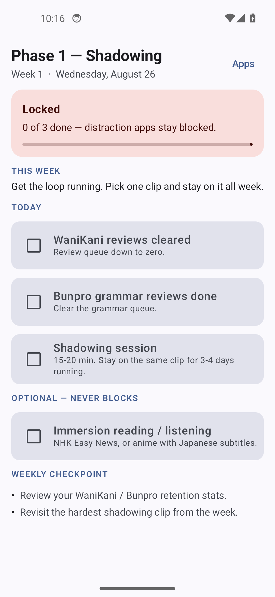
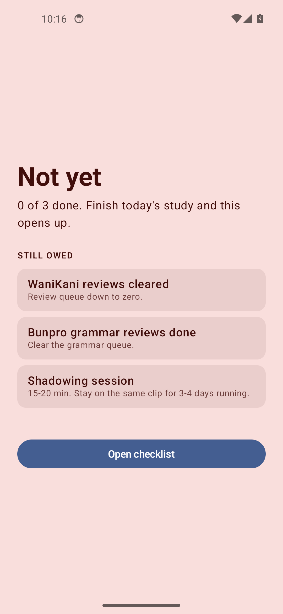
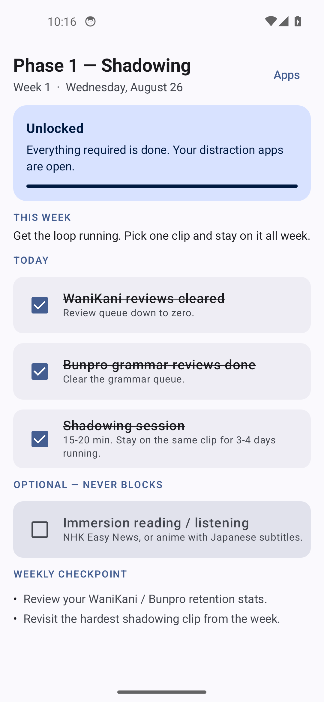

# Japanese Habit Lock

Android app for tracking a daily Japanese study habit against a structured roadmap.

[](https://github.com/Liktun/japanese-habit-lock/actions/workflows/ci.yml)

## Demo

The blocking gate, working on a real emulator — screenshots and a reproducible
script in [docs/demo/](docs/demo/README.md).

| Locked | Blocked app intercepted | Unlocked |
|---|---|---|
|  |  |  |

## Stack

- Kotlin, Jetpack Compose, Material 3
- Navigation 3
- DataStore (Preferences) for persistence
- `AccessibilityService` for foreground-app detection
- minSdk 26 / targetSdk 36, JDK 17

## How the gate works

1. `Roadmap.isUnlocked(phase, completedTaskIds)` is the single source of truth —
   the UI, the persisted mirror flag and the blocking service all route through it.
2. `HabitLockAccessibilityService` observes `TYPE_WINDOW_STATE_CHANGED` to learn
   which app is in the foreground. It holds no logic.
3. `ForegroundAppMonitor` — pure Kotlin, no Android deps, fully unit-tested —
   makes the decision, including a hardcoded always-allowed floor (Settings,
   SystemUI, launcher, dialer, telecom) so a corrupt blocked list can never lock
   you out of your own phone.
4. `BlockerActivity` replaces the blocked app with a list of what's still owed.

## Structure

```
app/src/main/java/com/liktun/japanesehabitlock/
├── domain/          DailyChecklist, Roadmap, StudyDay
├── data/            ChecklistRepository, HabitLockDataStore
│   └── apps/        InstalledAppsRepository (app picker source)
├── service/         ForegroundAppMonitor, HabitLockAccessibilityService
├── ui/checklist/    ChecklistScreen, ChecklistViewModel
├── ui/settings/     SettingsScreen, SettingsViewModel
├── ui/blocker/      BlockerActivity
├── theme/           Compose theme
└── MainActivity.kt, Navigation.kt, NavigationKeys.kt
```

## Build

Requires JDK 17 and the Android SDK (`ANDROID_HOME` set).

```bash
./gradlew test           # 82 unit tests
./gradlew assembleDebug  # debug APK -> app/build/outputs/apk/debug/
```

CI runs `test assembleDebug` on every push and PR to `main`, and uploads the
test reports and debug APK as artifacts.

## Privacy / Play policy

`android:isAccessibilityTool` is deliberately **not** set: this is a habit gate,
not an assistive tool, and claiming otherwise triggers Play Protect's "Deceptive
Accessibility Tool" warning. The service requests `canRetrieveWindowContent="false"`
— it reads the foreground package name and nothing else — and the settings screen
carries the prominent disclosure Play requires.

## Notes

`gradle.properties` forces IPv4 for dependency resolution — a workaround for a
broken IPv6 route to `dl.google.com` on the build host. Harmless elsewhere.
