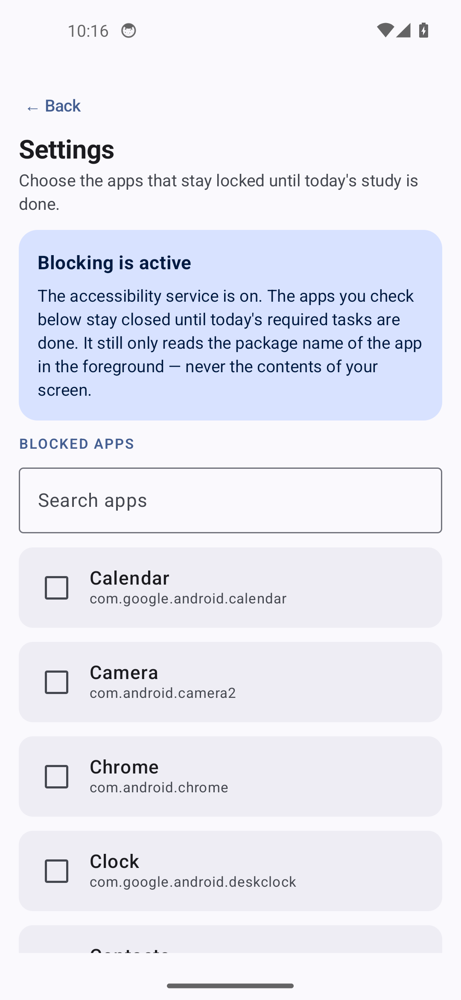
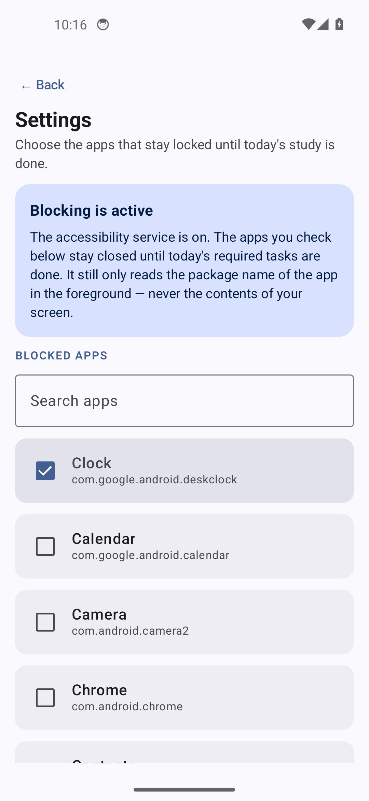
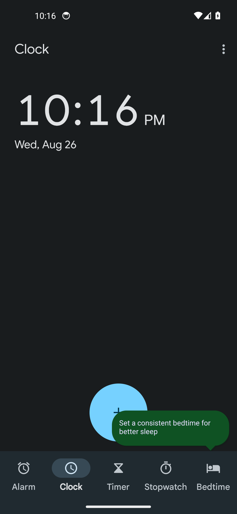

# Demo — the block gate working end to end

Captured on a headless Android 14 (API 34) emulator on the build host, driven by
[`demo-run.sh`](demo-run.sh). Not mockups: every screenshot below is a real
`screencap` from a device running the debug APK, and the pass/fail verdict is
read from `dumpsys activity activities`, not from what the UI appears to say.

Reproduce with:

```bash
bash docs/demo/boot-emulator.sh    # boots the AVD headless
bash docs/demo/demo-run.sh         # installs, drives the flow, prints a verdict
```

## The claim being tested

> While the gate is shut, opening a blocked app is intercepted. Once the day's
> required tasks are checked off, the same app opens normally.

Both halves are asserted — the second one matters just as much, because a
blocker that blocks *everything forever* would also pass the first test.

## 1. Fresh install — gate shut

`0 of 3 done — distraction apps stay blocked.`


## 2. Choosing what to block

The picker lists launchable apps. The disclosure card states plainly that the
service reads only the foreground package name and never screen contents.



## 3. Clock is now blocked



## 4. Opening the blocked app while locked

The interstitial replaces it, listing exactly what is still owed. No snooze,
no override — deliberately.

```
top activity: com.liktun.japanesehabitlock/.ui.blocker.BlockerActivity
```


## 5. Completing the required tasks

The gate flips. Note the optional task is still unchecked and the gate opened
anyway — optional tasks are tracked but never block.


## 6. The control: same app, now allowed

```
top activity: com.google.android.deskclock/com.android.deskclock.DeskClock
```



## Verdict

```
while LOCKED   top was: com.liktun.japanesehabitlock/.ui.blocker.BlockerActivity
while UNLOCKED top was: com.google.android.deskclock/com.android.deskclock.DeskClock
PASS: blocker intercepted the blocked app
PASS: app opened normally once unlocked
OVERALL: PASS
```

## Notes for anyone re-running this

- **The accessibility service is enabled over adb here.** On a real device the
  user must flip it manually in Settings; that cannot be automated, by design.
  The app detects the state and deep-links to the right screen.
- **`-gpu guest`, not `swiftshader_indirect`.** Under swiftshader the headless
  emulator segfaulted (exit 139) when rendering heavy apps.
- **Coordinates are hardcoded** for this AVD (1080x2340 @440dpi). Repeated
  `uiautomator dump` calls also crashed the emulator, so the layout is pinned
  rather than re-queried each run.
- **Clock is the stand-in "distraction app"** because it is light enough not to
  destabilise a software-rendered emulator. Any package works.
